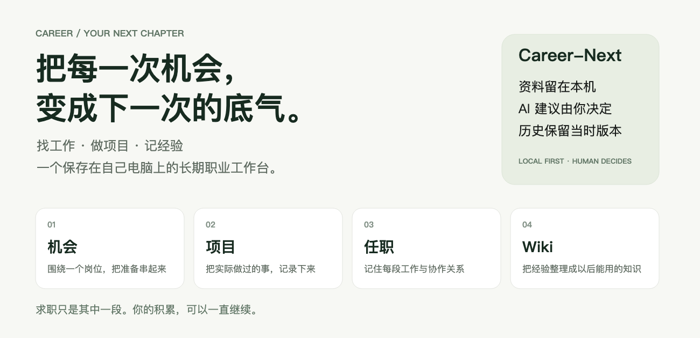
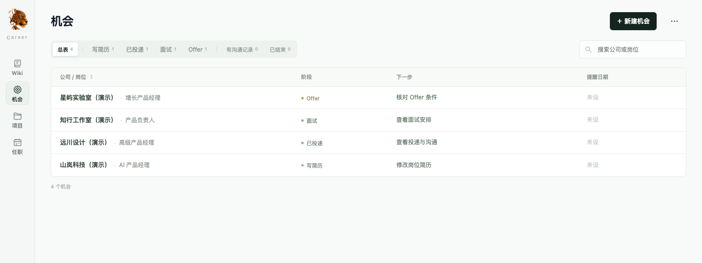
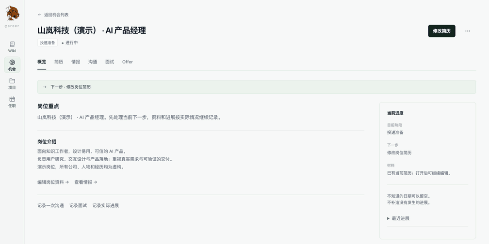
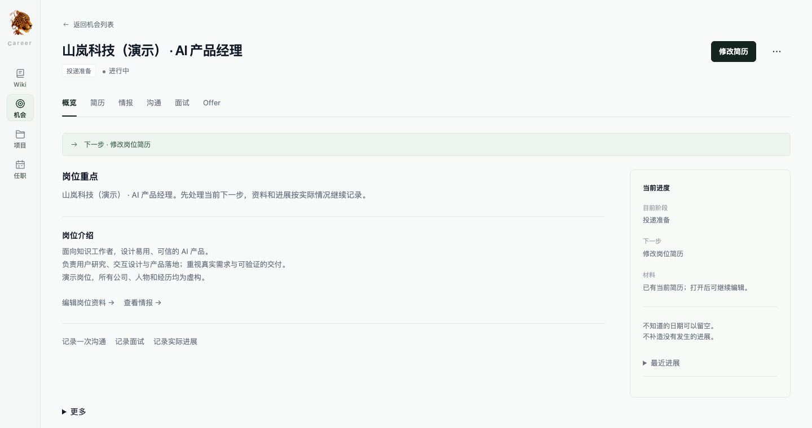
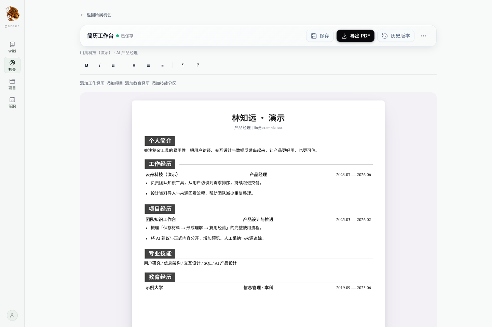
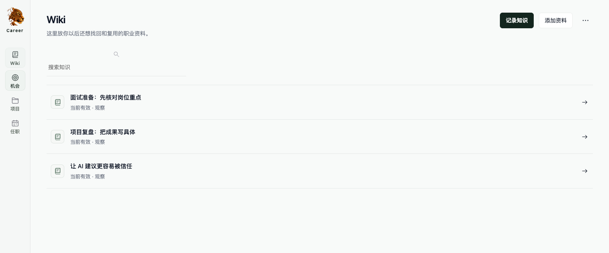
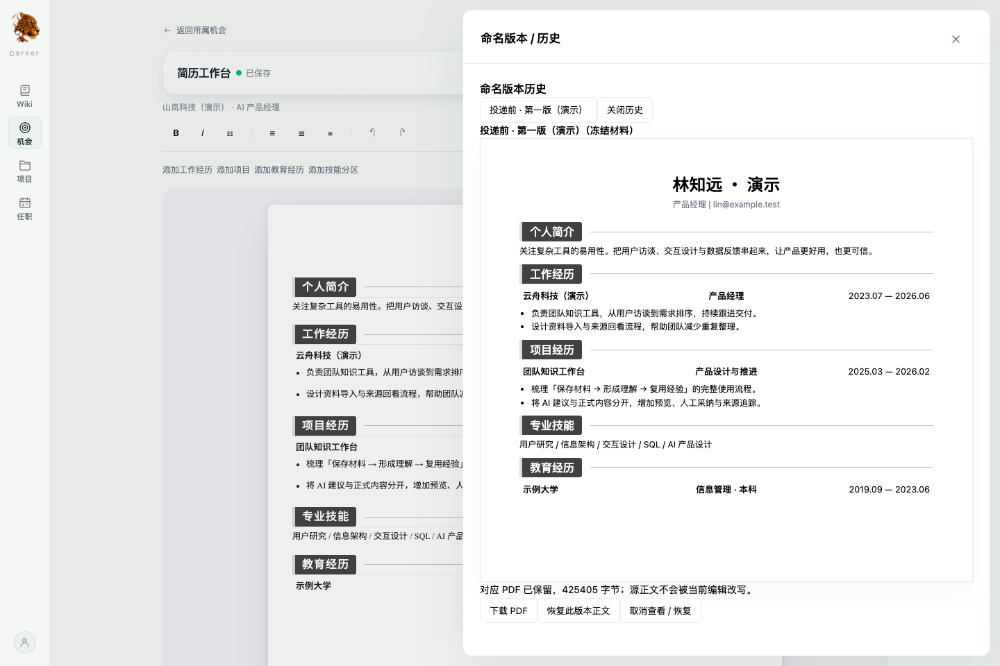
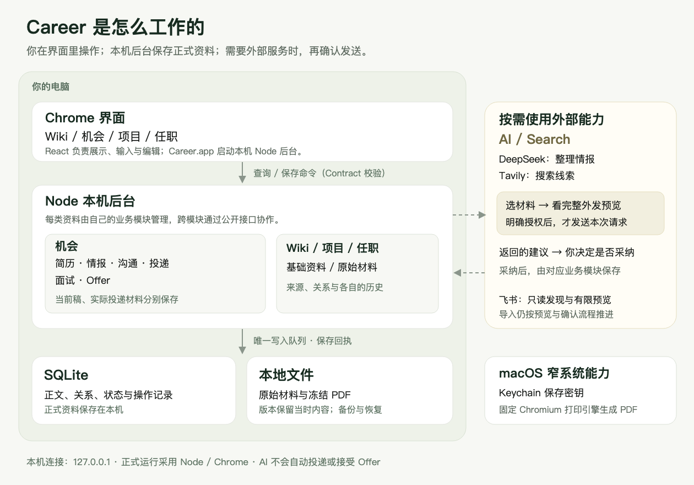

<div align="center">


# Career-Next

**把找工作、做项目、记经验，放进一个自己的工作台。**

资料保存在本机 · 不配置 AI 也能用 · 每份机会有自己的简历 · 历史保留当时版本

[看产品](#看一眼) · [设计里的小心思](#几个值得多说一句的设计) · [怎么工作](#它是怎么工作的) · [本机运行](#在自己电脑上跑起来) · [项目文档](#继续了解)

</div>



## 这是什么

Career 是一个保存在个人电脑上的长期职业工作台。

找工作时，把岗位、简历、公司情报、沟通和面试放在同一份机会里。入职后，继续记录项目、工作经历和协作关系。那些以后还能用上的经验，再整理进 Wiki。

**求职只是其中一段，积累可以一直继续。** 你可以一边工作、一边看新的机会，也可以只用它记录个人项目；不用每天填满所有页面，更不用先买一个模型服务才能开始。

## 从一份岗位开始

假设你看到一份「AI 产品经理」的岗位：

1. **先记下来。** 新建机会，填公司和岗位；岗位介绍以后再补也可以。
2. **针对它做准备。** 在这份机会里改简历、整理情报、记录沟通，准备面试。
3. **发生什么，记录什么。** 投递了就登记实际材料，面试了就记真实轮次，收到 Offer 再记条件。对方直接约面试，也不用补一条没发生过的投递。
4. **把经验留下。** 开始工作后，用项目和任职继续记录；把值得复用的理解放进 Wiki，下一次准备时还能找回来。

四个入口，各管一件容易理解的事：

| 入口 | 什么时候用 | 放什么 |
| --- | --- | --- |
| **机会** | 正在接触一份具体工作 | 岗位、简历、情报、沟通、面试与 Offer |
| **项目** | 想记住自己实际做过什么 | 目标、过程、成果与相关工作经历；个人项目也可以 |
| **任职** | 想整理一段真实的工作经历 | 工作起止、角色变化、同事和相关项目 |
| **Wiki** | 有一份经验或资料想长期复用 | 自己的理解、原始材料的来源、修订与研究引用 |

## 看一眼

以下截图与动图来自**当前开发版的真实前端**。公司、姓名、联系方式和经历都是虚构演示数据，使用独立 TEST 工作区；录制没有调用真实 AI、Search 或飞书服务。界面仍在持续打磨。

### 多个机会，放在一张表里

不用挨个点进去，先看公司、岗位、目前阶段和下一步。写简历、已投递、面试、Offer，可以按实际阶段筛选。



### 一份机会，六个工作分区

概览、简历、情报、沟通、面试、Offer 围绕同一个岗位展开。处理一件事时，始终知道自己在为哪份机会做准备。



<details>
<summary>想静静看：展开概览截图</summary>



</details>

### 简历，就在纸面上改

直接编辑 A4 纸面上的正文，调整加粗、对齐和要点列表，查看保存状态。想保留一个阶段，就给版本起名；要交付文件，直接导出 PDF。



### 经验，也有以后再看的地方

Wiki 留下你当前的理解。岗位情报可以从 Wiki 查看引用，回到所属机会编辑，减少同一段内容到处复制、后来又互相对不上的麻烦。



## 几个值得多说一句的设计

### 1. 现在怎么写，和当时发了什么，分开保存

你今天改了简历，昨天导出的 PDF 应该还是昨天那份。你更新了联系方式，也不应该悄悄改掉过去的版本。

Career 把当前稿、命名版本、导出 PDF 和实际投递材料分开保存。当前稿可以继续改；版本冻结当时的正文、本人资料和 PDF。登记投递时，记录实际使用的材料，没用简历、材料已丢失或无法确认，都可以照实记。



### 2. 原话、你的判断和 AI 建议，读起来有区别

导入的材料保留原话与出处；情报和 Wiki 保存你当前的理解。搜索结果是线索，AI 整理出的内容是建议，点击采纳也不等于它已经被独立核实。

这让你以后回看时，仍能分清：这是对方说过的、我当时推断的，还是后来确认的。

### 3. 把材料选进来之后，还要决定是否发出去

AI 任务里，选择要读的材料与授权外发是分开的。发送前看完整预览，知道哪些内容会发给哪一家服务，再决定是否发送。结果回来后，再决定采纳或拒绝。

**目前真实 DeepSeek 连接支持情报整理。** 简历、沟通、面试、Offer 的其他 AI 任务虽有本地受控验证，当前真实连接尚未全部开放。AI 不会替你投递、发送沟通、接受 Offer 或推进现实进度。

### 4. 结果没确认，先查清楚

保存或外部请求中断时，暂时没收到回音，不一定就是失败。应用保留输入，先核对原操作的保存记录或结果，再让你决定下一步。不会因为页面重连，就把上次的保存或 AI 请求自动再发一遍。

## 它是怎么工作的

平常，你在 Chrome 里操作，Node 后台在自己电脑上保存资料。只有需要外部 AI、搜索或飞书读取时，才进入相应的受控连接流程。



用大白话说：

- **界面负责让你看和改。** 正式保存由本机后台完成，每类资料都有负责它的模块。
- **资料有自己的保存位置。** 正文、关系和状态在 SQLite；原始材料和冻结 PDF 在本地文件中。备份与恢复围绕这份资料工作区进行。
- **AI 是按需帮忙的一步。** 授权后才发送，采纳后才保存到对应资料；服务没配好，手工功能照常可用。
- **系统能力尽量小。** macOS launcher 负责启动，Keychain 保存密钥，固定 Chromium 打印引擎生成 PDF。

当前运行方式是 `Career.app / npm start → 本机 Node 后台 → Chrome`，连接只监听 `127.0.0.1`。技术栈为 TypeScript、React、Tiptap、Node.js、SQLite、Kysely 和 Zod。宿主从 Electron 改为 Node / Chrome 的已批准修订见 [E1 / E2 说明](docs/adr/005-ELECTRON-RETIREMENT-E1.md)。

## 目前做到哪一步

| 能力 | 当前情况 |
| --- | --- |
| 手工职业工作台 | 四个入口、机会六分区、简历编辑、版本和 PDF、本地材料、备份与恢复已有实现 |
| 真实 AI / Search | DeepSeek 情报整理、Tavily 搜索已做隔离数据的受控真实验收；使用仍需配置与逐次授权 |
| 飞书 | 已验证只读连接身份、元数据发现、多维表格结构、有限记录预览及审批后单条 Raw 保存；范围仍受控，不宣称任意飞书文档一键导入 |
| 界面 | 现有体验基线已实施；A6 及当前简历纸面持续打磨，最终人工界面审批尚未收口 |
| 运行与验证 | 默认 Node / Chrome；G0–G5 及 G6 本地故障、恢复验收通过 |
| 对外分发 | 当前实测 macOS arm64；Developer ID 签名、公证和 x64 尚未验收，暂无正式发行包 |

完整验收入口见 [项目地图](MAP.md) 与 [验证记录](docs/verification/README.md)。这里的截图展示产品体验，不替代验收记录。

## 在自己电脑上跑起来

当前开发环境为 **macOS arm64、Node.js 24.21.0、npm 10.9.8 和 Chrome**。构建还需要 Swift 编译器及项目固定的 Playwright Chromium；可通过 Xcode Command Line Tools 提供 Swift。当前没有 Windows / Linux 正式支持承诺。

```sh
git clone https://github.com/frog-716/Career-Next.git
cd Career-Next
npm ci
npx playwright install chromium
npm run build
npm start
```

准备好后会自动在 Chrome 打开。第一次使用可以先新建机会，也可以先记项目或知识；无需配置 AI。

**关闭标签后，本机后台仍在。** 再次启动会复用后台并打开标签；需要完整退出时：

```sh
npm run stop
```

想保留自己的资料、单独试用一份演示工作区，可以指定一个绝对路径的 TEST 目录；启动和停止都要使用同一路径：

```sh
npm start -- --user-data-dir=/绝对路径/Career-TEST
npm run stop -- --user-data-dir=/绝对路径/Career-TEST
```

<details>
<summary>开发验证、打包与资料存放位置</summary>

```sh
npm run typecheck
npm test
npm run test:integration
npm run package
npm run test:browser
```

`npm run package` 生成 `out/Career-arm64/Career.app`，包含 launcher、Node、前端、Keychain helper 和 PDF 引擎。当前产物为 ad-hoc 签名的本机验证包；正式分发仍待签名、公证和对应平台验收。

应用 profile 下的 `active-workspace-pointer.json` 指向当前资料库，初始为 `workspaces/local/`。`career.sqlite` 保存正式资料与操作记录，`blobs/` 保存原件和冻结 PDF。恢复通过完整备份的候选验证与明确切换完成。

浏览器不能回读已保存的 Key。密钥不进入 URL、localStorage 或业务备份；旧 Electron 凭据不会自动解密或迁入。配置方法见 [凭据重新配置](docs/operations/CREDENTIAL-REENTRY.md)。

</details>

## 继续了解

| 想了解什么 | 从这里开始 |
| --- | --- |
| 普通用户怎么用 | [使用指南](docs/ux/USER-GUIDE.md) |
| 代码和文档在哪里 | [MAP.md](MAP.md) |
| 产品规则 | [Product Spec Frozen R3](docs/product-spec/rebuild-spec/README.md) |
| 架构与业务模块 | [Architecture V2](docs/architecture/ARCHITECTURE.md) · [模块边界](docs/architecture/MODULES.md) · [当前宿主修订](docs/adr/005-ELECTRON-RETIREMENT-E1.md) |
| 哪些已经验证 | [验收索引](docs/verification/README.md) · [真实外部验收](docs/verification/j07-real-external.md) · [本地故障与恢复](docs/verification/g6-final.md) |
| 反馈问题或提出需求 | [GitHub Issues](https://github.com/frog-716/Career-Next/issues) |

<details>
<summary>README 图片和动图如何更新</summary>

封面与架构图使用可编辑 SVG 源码，同时生成 PNG；截图与动图录制真实前端，用虚构数据经过正式业务模块保存。素材位于 [`docs/assets/readme/`](docs/assets/readme/)，不会读取个人资料工作区。

```sh
# 先构建当前界面
npm run build
# 封面与架构图（生成 SVG / PNG）
node scripts/readme-artwork.mjs
# 独立 TEST 工作区录制；完成后自动清理工作区
node_modules/.bin/jiti scripts/readme-capture.ts
# 用 Pillow 编码动图；录制帧保存在 Git 忽略的 out/ 中
python3 scripts/readme-gif.py
```

截图脚本禁用真实 AI / Search / 飞书连接，浏览器仅允许访问本次本机服务。GitHub README 直接嵌入 PNG / GIF，静态截图也可独立阅读。

</details>

展示结构参考 [AIHOT](https://github.com/KKKKhazix/AIHOT)：先讲用途和场景，再用图片解释流程。文案、架构图和产品素材均按 Career 当前业务重新制作。
